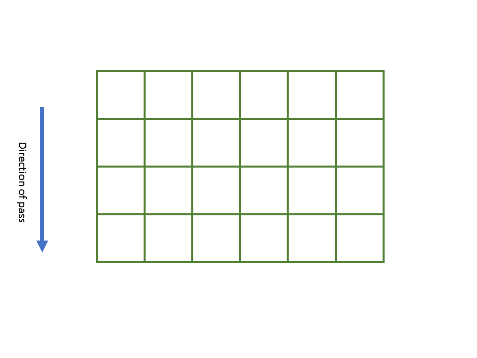
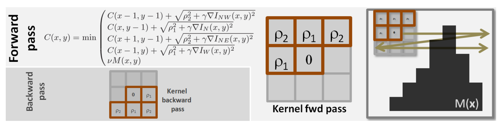
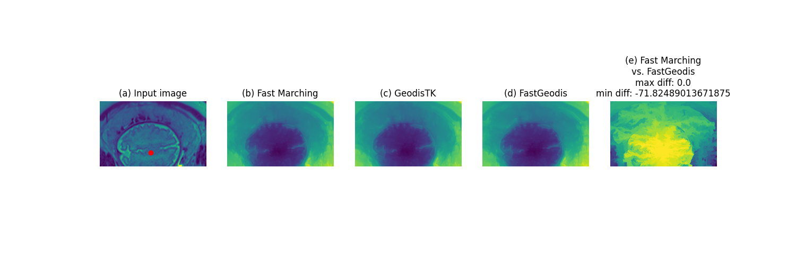
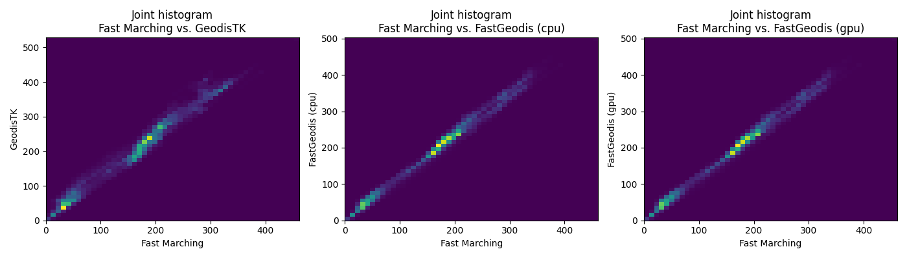
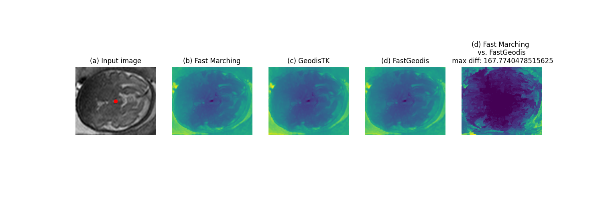
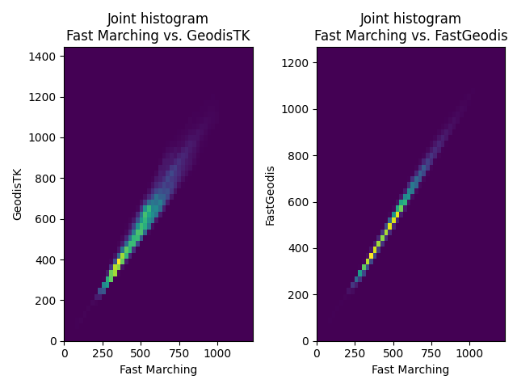

*****************
Methodology
*****************

Generalised Geodesic Distance Transform
#######################################

A distance transform maps each image pixel/voxel into its smallest distance to regions of interest :cite:p:`fabbri20082d`. It is a fundamental operator with relevant applications in computer vision, graphics, shape analysis, pattern recognition and computational geometry :cite:p:`fabbri20082d`. 

Generalised Geodesic distance transform combines spatial as well as gradient based distance transform and is defined as :cite:p:`criminisi2008geos`:

.. math:: 
    d(\mathbf{x}; I, \lambda) = \min \sum_{k=1}^{n} \Big[ \underbrace{\left( 1-\lambda \right) \left \| \mathbf{x}_k - \mathbf{x}_{k-1}  \right \|_{L1}}_{\text{Euclidean Term}} + \underbrace{\lambda \left | I(\mathbf{x}_k) - I(\mathbf{x}_{k-1})  \right |}_{\text{Geodesic Term}} \Big]

The ability to incorporate image gradients with spatial distances has enabled application of Geodesic distance transforms in a number of areas, including image editing and filtering :cite:p:`criminisi2008geos`.  Methods from recent years have shown effectiveness in applying Geodesic distance transform to interactively annotate 3D medical imaging data :cite:p:`wang2018deepigeos,criminisi2008geos`, where it enables providing segmentation labels, i.e. voxel-wise labels, for different objects of interests.

Statement of Need
##################

Despite existing open-source implementation of distance transforms :cite:p:`tensorflow2015-whitepaper,eucildeantdimpl,geodistk`, open-source implementations of efficient Geodesic distance transform algorithms :cite:p:`criminisiinteractive,weber2008parallel` on CPU and GPU do not exist. However, efficient CPU :cite:p:`eucildeantdimpl` and GPU :cite:p:`tensorflow2015-whitepaper` implementations exist for Euclidean distance transform. To the best of our knowledge, **FastGeodis** is the first open-source implementation of efficient Geodesic distance transform :cite:p:`criminisiinteractive`, achieving up to 20x speed-up on CPU and up to 74x speed-up on GPU as compared to existing open-source libraries :cite:p:`geodistk`. It also provides efficient implementation of Euclidean distance transform. In addition, it is the first open-source implementation of generalised Geodesic distance transform and Geodesic Symmetric Filtering (GSF) proposed in :cite:p:`criminisi2008geos`. 
  

The ability to efficiently compute Geodesic and Euclidean distance transforms can significantly enhance distance transform applications especially for training deep learning models that utilise distance transforms :cite:p:`wang2018deepigeos`. It will improve prototyping, experimentation, and deployment of such methods, where efficient computation of distance transforms has been a limiting factor. In 3D medical imaging problems, efficient computation of distance transforms will lead to significant speed-ups, enabling online learning applications for better processing/labelling/inference from volumetric datasets :cite:p:`asad2022econet`.  In addition, **FastGeodis** provides efficient implementation for both CPUs and GPUs hardware and hence will enable efficient use of a wide range of hardware devices. 

Implementation
#################
**FastGeodis** implements an efficient distance transform algorithm from :cite:p:`criminisiinteractive`, which provides parallelisable raster scans to compute distance transform. The implementation consists of data propagation passes parallelised using threads for elements across a line (2D) or plane (3D). Figure below shows these data propagation passes, where each pass consists of computing distance values for next row (2D) or plane (3D) by utilising parallel threads and data from previous row/plane, hence resulting in propagating distance values along the direction of pass. For 2D data, four distance propagation passes are required, top-bottom, bottom-top, left-right and right-left, whereas for 3D data six passes are required, front-back, back-front, top-bottom, bottom-top, left-right and right-left. The algorithm can be applied to efficiently compute both Geodesic and Euclidean distance transforms. In addition to this, **FastGeodis** also provides non-parallelisable raster scan based distance transform method from :cite:p:`toivanen1996new`, which is implemented using single-thread CPU and used for comparison.

.. table:: 
   :align: center

   +--------------------------------------------+--------------------------------------------+
   |   **2D images:** 1 of 4 passes             |   **3D volumes:** 1 of 6 passes            |
   +--------------------------------------------+--------------------------------------------+
   | .. figure:: ../../figures/FastGeodis2D.png | .. figure:: ../../figures/FastGeodis3D.png |
   |   :alt: 2D                                 |   :alt: 3D                                 |
   |                                            |                                            |
   +--------------------------------------------+--------------------------------------------+

**FastGeodis** package is implemented using **PyTorch** :cite:p:`NEURIPS2019_9015` utilising OpenMP for CPU and CUDA for GPU parallelisation of the algorithm. It is accessible as a python package, that can be installed across different operating systems and devices. A comprehensive documentation and a range of examples are provided for understanding the usage of the package on 2D and 3D data using CPU or GPU. The provided examples include 2D/3D examples for Geodesic, Euclidean, Signed Geodesic distance transform as well as computing Geodesic symmetric filtering (GSF) that is essential first step in implementing interactive segmentation method from :cite:p:`criminisi2008geos`. 

In the following section, more details of each implemented algorithm is presented. 

Criminisi et al's Parallelisable Generalised Geodesic Distance Transform
************************************************************************
We implement both 2D and 3D parallelisable generalised Geodesic distance transform algorithms from :cite:p:`criminisiinteractive` on both CPU (OpenMP) and GPU (CUDA). The 2D algorithm works by computing distance propagation in one row at a time. This is a hard constraint because compute for each row is dependent on computed distances in previous rows from previous invocation. Consider an example of an image with 4 x 6 dimension. Then a successful full iteration of our method would involve going through the rows one by one as follows:

As can be seen, this involves top-down and left-right passes. How we implement left-right is by reusing top-down code and transposing the data instead. Please note that for each step, only the pixels highlighted in green color can be computed (as they have the data available from previous row). It is this row that we split into multiple threads using an underlying hardware (CPU or GPU). This parallelisation enables speed-up as compared to non-parallelisable CPU implementations, e.g. in :cite:p:`geodistk` which implements raster scan algorithm from :cite:p:`toivanen1996new`. 

Going beyond 2D images, we also implement the parallelisable Geodesic distance transform for 3D data. We provide both CPU (OpenMP) and GPU (CUDA) optimised implementations. Our 3D implementation operates on the same principle (we can process one plane at a time). However, in 3D case, since we have more data, we can utilise more compute on GPU and process a plane in parallel, however we still have the data dependency constraints that prevent us from processing all planes together.

:cite:p:`weber2008parallel` presents a further optimised approach for computing Geodesic distance transforms on GPUs, however this method is protected by multiple patents and hence is not suitable for open-source implementation in **FastGeodis** package.

Toivanen et al's Non-parallelisable Generalised Geodesic Distance Transform
***************************************************************************
In addition to parallelisable algorithm from :cite:p:`criminisiinteractive`, we also implement non-parallelisable Geodesic distance transform method from :cite:p:`toivanen1996new` using CPU. This method is used for comparison of accuracy as well as execution of the parallelised Geodesic distance transform algorithm presented above.

In this method, a 2D pass operates as a raster scan that is sequentially applied in two passes: forward and backward. Figure below, shows an overview of this method, as described in :cite:p:`criminisi2008geos`:

    
    Raster scan method from :cite:p:`toivanen1996new`. Figure from :cite:p:`criminisi2008geos`.

For both forward and backward pass, an L shaped kernel is used in a single raster scan pass to propagate distance in forward and backward direction. In particular, this L shaped kernel along with the sequential pass limits this method to non-parallelisable CPU implementation, which we include in **FastGeodis** for comparison purposes.

Sethian's Fast Marching-based Non-parallelisable Generalised Geodesic Distance Transform
****************************************************************************************
In addition to the above methods, we also implement fast marching based non-parallelisable Geodesic distance transform method from :cite:p:`sethian1999fast` using CPU. This method is used for comparison of accuracy as well as execution of the parallelised Geodesic distance transform algorithm presented above. It serves as golden reference as this method provides accuracy distance transform calculation. While being accurate, it is computationally expensive taking orders of magnitude more time and compute. 

Performance Improvements
################################
FastGeodis (CPU/GPU) is compared with existing GeodisTK (https://github.com/taigw/GeodisTK) in terms of execution speed as well as accuracy. All our experiments were evaluated on Nvidia GeForce Titan X (12 GB) with 6-Core Intel Xeon E5-1650 CPU. We present our results below:

Execution
*******************
The following figures summarise execution speed comparison of **FastGeodis** with :cite:p:`geodistk`.

.. table:: 
   :align: center

   +--------------------------------------------+--------------------------------------------+
   |   **Execution Speed for 2D images**        |   **Execution Speed for 3D volumes**       | 
   +--------------------------------------------+--------------------------------------------+
   | .. figure:: ../../figures/experiment_2d.png| .. figure:: ../../figures/experiment_3d.png|
   |   :alt: 2D                                 |   :alt: 3D                                 |
   |                                            |                                            |
   +--------------------------------------------+--------------------------------------------+

The above results are further summarised in tables below, along with calculated speed-ups for **FastGeodis** functions vs :cite:p:`geodistk`:

.. csv-table:: Execution speed-up on 2D images
   :file: experiment2d.csv
   :widths: 10, 10, 10, 10, 10, 10
   :header-rows: 2

.. csv-table:: Execution speed-up on 3D volumes
   :file: experiment3d.csv
   :widths: 10, 10, 10, 10, 10, 10
   :header-rows: 2

It can be observed that for 2D images, **FastGeodis** leads to a speed-up of upto 20x on CPU and upto 55x on GPU.
For 3D images, **FastGeodis** leads to a speed-up of upto 3x on CPU and upto 74x on GPU.

Accuracy
*******************
For accuracy, we use Fast Marching-based implementation as golden reference. These results are visualised below for visual comparison as well as quantitative comparison using joint histograms.

2D Image Data
================
 

3D Image Data
==================

.. bibliography::